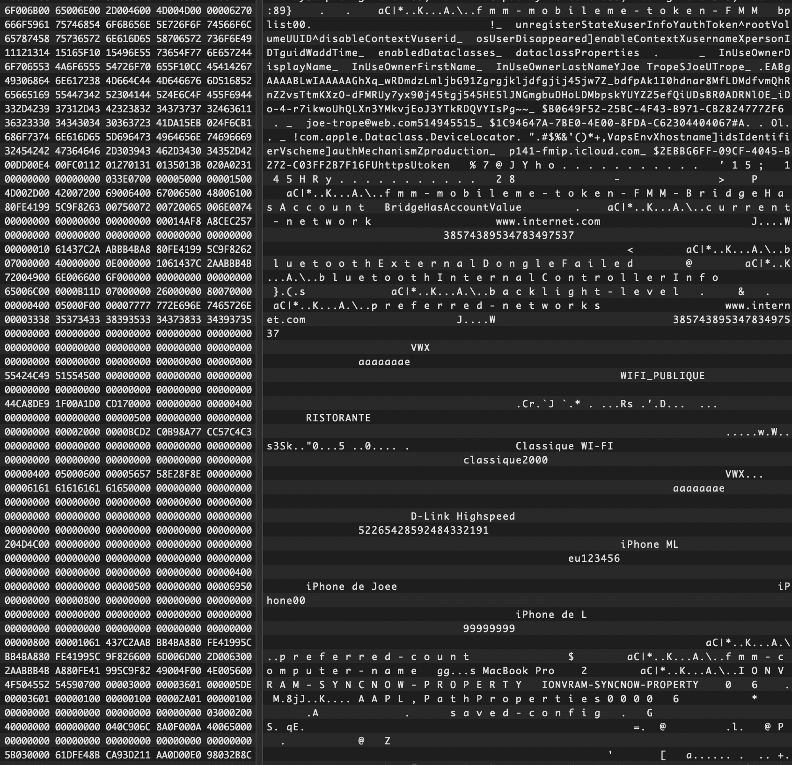

# Data Extraction from Locked T2 Macs

⚠️ **Read this at your own risk!**  
This information is based on personal research and early reverse engineering efforts.  
It may contain mistakes or be partially/completely wrong — **DYOR** before trusting anything!


## Introduction

Apple’s **T2 chip** was designed to improve security on Intel-based Macs by integrating:

- **Secure Enclave Processor (SEP):** manages keys, Touch ID, and authentication.  
- **Hardware Storage Encryption:** ties SSD data to the device, blocking raw disk swaps.  
- **Secure Boot:** ensures only signed, untampered macOS can boot.  
- **SMC (System Management Controller):** handles power and system-level management.  

On paper, this makes Macs more resistant to tampering and forensic attacks.  
But...


## Sensitive Data in NVRAM

Even with T2, **NVRAM** (non-volatile RAM) continues to store system state and user-related information.  
Unlike the main SSD, NVRAM is **not encrypted**, meaning data can be read if you have physical access (e.g., via a checkm8-based ramdisk).

Examples of sensitive information recoverable from NVRAM include:

- Apple ID or admin account email  
- Usernames and surnames tied to setup  
- Wi-Fi SSIDs and passwords of joined networks  



📂 Additional user-related data can also be found at:  
```

/var/containers/Data/System/9960E93D-2665-451C-9D3A-3B62AA98EE87/Library/Preferences/FMMAccount.plist.plist

```

This persistence of **plaintext user data** poses a risk for privacy, as attackers or forensic investigators could extract it without defeating T2’s encryption.


## Disclaimer

- This guide is for **educational purposes only**.  
- Do **not** use this for illegal activities.  
- Apple may patch this behavior at any time.  

© 2025 ~ Hana Kim
